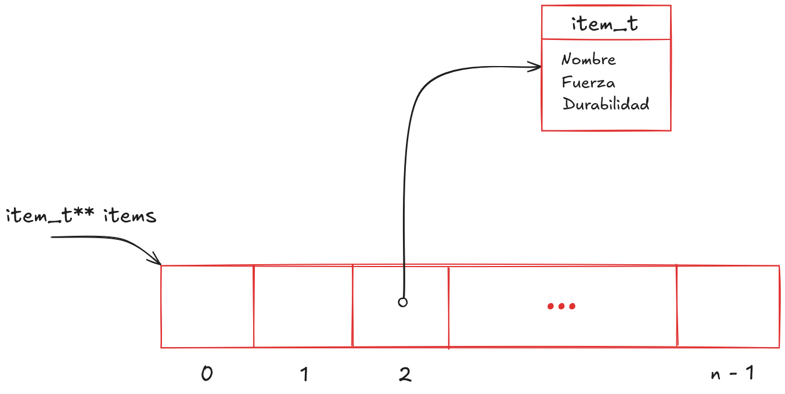
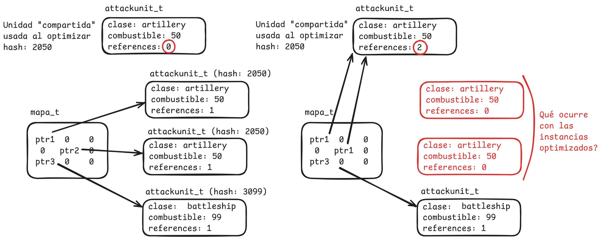
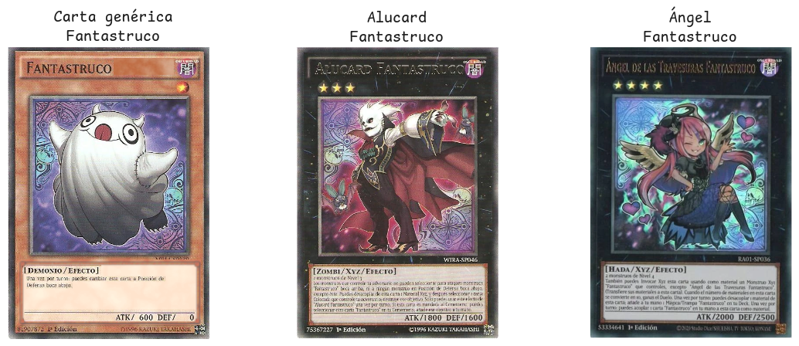
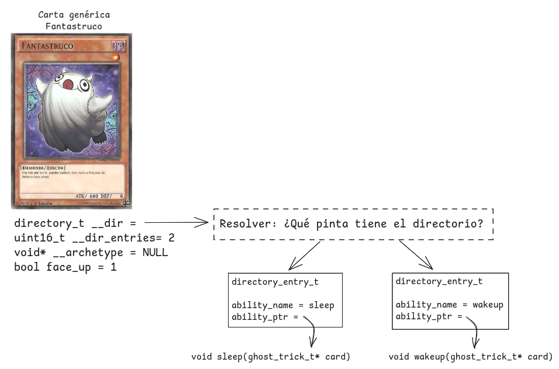
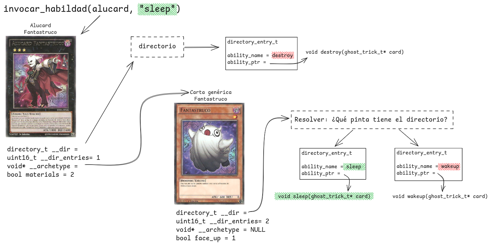

# Ejercicios integradores

Estos ejercicios presentan una estructura y dificultad similar a lo que será evaluado en el primer parcial. Recomendamos hacerlos una vez que hayan visto todos los temas anteriores de la guía y, si pueden, hacerlos simulando la situación de examen.

Para todos los ejercicios sugerimos primero implementarlos en C, y una vez que pasen los tests escribir esos algoritmos en ASM.

Hay un esqueleto para cada ejercicio con los tests correspondientes y una plantilla para completar implementaciones en C/ASM de cada inciso.

## Compilación y Testeo

Para compilar y ejecutar los tests cada ejercicio dispone de un archivo
`Makefile` con los siguientes *targets*:

| Comando             | Descripción                                                         |
| ------------------- | ------------------------------------------------------------------- |
| `make test_c`       | Genera el ejecutable usando la implementación en C del ejercicio.   |
| `make test_asm`     | Genera el ejecutable usando la implementación en ASM del ejercicio. |
| `make test_abi`     | Genera usando la implementación en ASM del ejercicio + archivos necesarios para ABI enforcer |
| `make run_c`        | Corre los tests usando la implementación en C.                      |
| `make run_asm`      | Corre los tests usando la implementación en ASM.                    |
| `make run_abi`      | Corre los tests usando la implementación en ASM + ABI enforcer.     |
| `make valgrind_c`   | Corre los tests en valgrind usando la implementación en C.          |
| `make valgrind_asm` | Corre los tests en valgrind usando la implementación en ASM.        |
| `make valgrind_abi` | Corre los tests en valgrind usando la implementación en ASM + ABI enforcer        |
| `make clean`        | Borra todo archivo generado por el `Makefile`.                      |

El sistema de tests **sólo correrá los tests que hayan marcado
como hechos**. Para esto deben modificar la variable `EJERCICIO_xx_HECHO`
correspondiente asignándole `true` (en C) ó `TRUE` (en ASM). `xx` es el inciso
en cuestión: `nA` o `nB`.

**Para que la resolución de un ejercicio se considere como correcta, tiene que funcionar el ABI enforcer**. Sin embargo, el ABI enforcer no garantiza la ausencia de errores. Pueden haber fallas como, por ejemplo, la posibilidad de tener overflows/underflows en entradas grandes que no son detectadas por el ABI enforcer.

# Ejercicio 1

Como parte del espectacular juego AAA llamado "AyOC 2 - La venganza de los
punteros" estamos diseñando su sistema de inventario. Los jugadores pueden tener
grandes cantidades de ítems en sus inventarios y quieren poder reordenarlos con
total fluidez. Debido a estos requisitos de performance se solicita implementar
en ensamblador algunas funciones del sistema de manipulación de inventarios.

La estructura utilizada para representar ítems es la siguiente:
```c
typedef struct {
    char nombre[18];
    uint32_t fuerza;
    uint16_t durabilidad;
} item_t;
```

El inventario se implementa como un array de punteros a ítems. Nuevos ítems
siempre se agregan al final. La siguiente imagen ejemplifica el inventario:



Uno de los requisitos más importantes es el de poder ver los ítems _más
fuertes_/_con menos daño_/_más baratos_/etc en simultáneo. Para lograr esto el
juego mantiene una serie de índices que indican la permutación necesaria para
mostrar el inventario según cada criterio.

Supongamos entonces que queremos mostrar la vista de ítems según daño:
```c
items_danio[i] = inventario[indices_danio[i]];
```

Si en su lugar quisiéramos verlos ordenados por durabilidad:
```c
items_durabilidad[i] = inventario[indices_durabilidad[i]];
```

Estos índices nos permiten mantener múltiples nociones de orden en simultáneo sin tener que mantener múltiples copias de los inventarios (alcanza con mantener los índices).

Hay muchísimos criterios de orden posibles por lo que además definimos un tipo
de dato para poder hablar de ellos:
```c
typedef bool (*comparador_t)(item_t*, item_t*);
``` 

## 1A - Detectar índices ordenados
Las vistas del inventario son editables y nos gustaría poder detectar cuando una
vista es equivalente a ordenar el inventario según una función de comparación.
Esto permitiría ahorrar memoria representando esas vistas como "el resultado de
ordenar la lista usando X" en lugar de tener que escribir todo el índice.

Para realizar esto se solicita implementar en ensamblador una función que
verifique si una vista del inventario está correctamente ordenada de acuerdo a
un criterio. La firma de la función a implementar es la siguiente:
```c
bool es_indice_ordenado(item_t** inventario, uint16_t* indice, uint16_t tamanio, comparador_t comparador);
```

Dónde:
- `inventario`: Un array de punteros a ítems que representa el inventario a
  procesar.
- `indice`: El arreglo de índices en el inventario que representa la vista.
- `tamanio`: El tamaño del inventario (y de la vista).
- `comparador`: La función de comparación que a utilizar para verificar el
  orden.

Tenga en consideración:
- `tamanio` es un valor de 16 bits. La parte alta del registro en dónde viene
  como parámetro podría tener basura.
- `comparador` es una dirección de memoria a la que se debe saltar (vía `jmp` o
  `call`) para comenzar la ejecución de la subrutina en cuestión.
- Los tamaños de los arrays `inventario` e `indice` son ambos `tamanio`.
- `false` es el valor `0` y `true` es todo valor distinto de `0`.
- Importa que los ítems estén ordenados según el comparador. No hay necesidad
  de verificar que el orden sea estable.

## 1B - Materializar índices

Cuando una vista es muy importante para un jugador se puede escoger reordenar el
inventario en base a esta. Nuestros índices son básicamente una forma de
representar permutaciones del inventario. Se solicita implementar una función
que dado un inventario y una vista cree un nuevo inventario que mantenga el
orden descrito por la misma.

Es decir:
```math
\forall i \in [0; \text{tamanio})\quad  \text{resultado}[i] = \text{inventario}[\text{vista}[i]]
```

La memoria a solicitar para el nuevo inventario debe poder ser liberada
utilizando `free(ptr)`.

La función debe tener la siguiente firma:
```c
item_t** indice_a_inventario(item_t** inventario, uint16_t* indice, uint16_t tamanio);
``` 

Donde:
- `inventario` un array de punteros a ítems que representa el inventario a
  procesar.
- `indice` es el arreglo de índices en el inventario que representa la vista
  que vamos a usar para reorganizar el inventario.
- `tamanio` es el tamaño del inventario.

Tenga en consideración:
- Tanto los elementos de `inventario` como los del resultado son punteros a
  `ítems`. Se pide *copiar* estos punteros, **no se deben crear ni clonar
  ítems**


# Ejercicio 2

Luego del éxito de nuestro último juego "AyOC - la venganza de los punteros" hemos decidido incursionar al mundo de los juegos de estrategia por turnos para nuestro próximo juego, "Organized Wars".

En su turno, el jugador podrá colocar en un mapa de juego cuadriculado varias unidades de ataque de distintas clases. Cada clase tiene un valor inicial de combustible cargado, el cuál utilizarán en una etapa posterior para realizar acciones como moverse, disparar bombas, etc. Además del combustible precargado, el jugador cuenta con una reserva extra de combustible que puede repartir entre las unidades que desee, potenciando ciertas unidades puntuales.

Dado que es común que los jugadores reposicionen y modifiquen los niveles de combustible de las unidades constantemente durante su turno, el sistema de nuestro juego funciona del siguiente modo:

- Durante el transcurso del turno, cada unidad de ataque agregada se instancia independientemente. 
- Al momento de finalizar el turno, se revisa que el jugador no haya asignado más combustible extra del que tenía disponible en su reserva. De haber asignado combustible correctamente, se efectiviza el final del turno.
- Una vez finalizado el turno, se corre una optimización que reemplaza todas las instancias independientes de unidades equivalentes por una única instancia "compartida"" (donde dos unidades son equivalentes si el resultado de aplicar una función de hash dada sobre cada una es el mismo).



**a)** Programar en lenguaje assembler una función que, dado el puntero a un personaje, "optimice" todas las unidades del mapa que sean
equivalentes utilizando en su lugar la versión pasada por parámetro. La solución debe hacer un uso apropiado
de la memoria, teniendo en cuenta que las referencias a unidades solo son guardadas en el mapa.

`void optimizar(mapa_t mapa, personaje_t* compartida, uint32_t *fun_hash)`

**b)** Programar en lenguaje assembler una función

`uint32_t contarCombustibleAsignado(mapa_t mapa, uint16_t (*fun_combustible)(char*))`

que se utilizará para calcular, antes de finalizar el turno del jugador, la cantidad de combustible **de la reserva** que fue asignado por el jugador. La funcion fun_combustible pasada por parametro, toma una clase de unidad y devuelve la cantidad de combustible base que le corresponde.

---

Luego de la optimización cominenza la fase de batalla, en la que las unidades realizarán acciones y sus niveles de combustible se modificarán de manera acorde. Si se modifica una unidad que está compartiendo instancia por una optimización, se debe crear una nueva instancia individual para esta en lugar de modificar la instancia compartida (lo cual resultaría en modificaciones indebidas en otras unidades).

**c)** Programar en lenguaje assembler una función
    
`void modificarUnidad(mapa_t mapa, uint8_t x, uint8_t y, void *fun_modificar)`

que dada una posición en el mapa permita aplicar la función modificadora a la unidad en esa posición **únicamente**. 
La solución propuesta debe tener en cuenta el caso en que se quiera modificar una unidad que previamente había sido optimizada, sin hacer uso excesivo o innecesario de recursos del sistema.

De no haber una unidad en la posición especificada, no se debe hacer nada.

---
**Observaciones:**

- La instancia compartida podría ser una **nueva instancia** o **alguna de las instancias individuales preexistentes**.
- En los tests se utiliza un area del mapa de 5x5 lugares para simplificar la visualización, pero es importante que se resuelva correctamente para el mapa completo.
- Para cada función se incluye un último test que sí trabaja sobre un mapa de tamaño máximo. Este test no correrá hasta que los anteriores pasen exitosamente.
- A fin de debuggear puede ser útil revisar la función de hash utilizada en los tests, la cual está definida al principio de `test.c`.

# Ejercicio 3

Un prestigioso banco de los Estados Unidos, el **Orga2-Morgan**, nos solicitó ayuda para procesar sus colas de atención al cliente. Poder priorizar los casos es de suma importancia para el banco, ya que si los usuarios dejan buenas reseñas, les resulta más fácil atraer nuevos clientes.

El equipo de IT del banco nos brinda las siguientes estructuras:

## Estructura: Caso

```
typedef struct {
	char[3] categoria;
	uint16_t estado;
	usuario_t* usuario;
} caso_t;
```

Esta estructura representa un caso. Contiene:

- `categoria`: puede ser `"CLT"`, `"RBO"`, `"KSC"` o `"KDT"`.
- `estado`: puede tomar los valores:
  - `0`: caso abierto
  - `1`: cerrado favorablemente
  - `2`: cerrado desfavorablemente
- `usuario`: puntero a un usuario asociado al caso.

## Estructura: Usuario

```
typedef struct {
	uint32_t id;
	uint32_t nivel;
} usuario_t;
```

Donde:

- `id`: identificador único del usuario.
- `nivel`: puede ser `0`, `1` o `2`, representando el nivel de prioridad del cliente.

---

## Ejercicio 3a

La primer funcionalidad que nos solicitaron es poder segmentar los casos según el nivel del usuario, para así poder priorizar la atención en función de la importancia de cada cliente para la compañía.

La firma de la función a implementar es:

```
segmentacion_t* segmentar_casos(caso_t* arreglo_casos, int largo)
```

Donde:

```
typedef struct {
	caso_t* casos_nivel_0;
	caso_t* casos_nivel_1;
	caso_t* casos_nivel_2;
} segmentacion_t;
```
Que dada una lista de casos, los ordene de acuerdo al nivel de prioridad del usuario que lo abrió. El parametro `largo` indica la longitud del arreglo pasado por parametro. La estructura retornada no debe utilizar más memoria de la necesaria.

> 💡 **Sugerencia**: puede ser útil comenzar implementando una función auxiliar como:
> 
> ```
> int contar_casos_por_nivel(caso_t* arreglo_casos, int largo, int nivel)
> ```

> ⚠️ **Importante**: asegurarse de que los *offsets* estén correctamente definidos y utilizados.

---

## Ejercicio 3b

El segundo requerimiento consiste en implementar una funcionalidad de cierre automático de casos utilizando inteligencia artificial, con el objetivo de reducir costos operativos.

El equipo de Machine Learning de Orga2-Morgan (liderado por el prestigioso científico **Satoshi Nakamoto**) proveerá una función que, dado un caso, indicará si puede cerrarse automáticamente o no.

La función a implementar es:

```
void resolver_automaticamente(funcionCierraCasos* funcion, caso_t* arreglo_casos, caso_t* casos_a_revisar, int largo)
```

### Lógica a implementar

- Para los casos de usuarios de nivel `1` o `2`:
  - Llamar a `funcionCierraCasos` que recibe un caso y retorna 0 o 1.
  - Si el resultado es `1`, el caso se puede cerrar automáticamente, marcándolo como cerrado favorablemente (`estado = 1`).
  - Si el resultado es `0` y la categoría del caso es `"CLT"` o `"RBO"`, el caso se puede cerrar automáticamente, marcando el caso como cerrado desfavorablemente (`estado = 2`).
  - En otros casos, el caso no se puede cerrar automáticamente por lo que no se debe modificar el estado.

- Para los casos de usuarios de nivel `0`, no se realiza ninguna acción (no se pueden cerrar automáticamente).
- Además, se solicita que los casos en los que no se tomo accion, es decir los que no se cerraron automáticamente, sean agregados al arreglo `casos_a_revisar` pasado por parámetro. 

> 🛠️ **Tip**: para comparar strings se puede utilizar la función `strncmp(char* str1, char* str2, size_t n)` de la biblioteca `string.h`. Notar que el campo categoría no termina con '\0'!

> 🛠️ **Tip**: se puede asumir que el arreglo `casos_a_revisar` tiene tamaño suficiente y está inicializado con todas sus posiciones en 0.

---

## Ejercicio 3c

Por último nos pidieron implementar una función que calcule estadísticas. 

```
estadisticas_t* calcular_estadisticas(caso_t* arreglo_casos, int largo, uint32_t usuario_id);
```

Donde:

```
typedef struct {
	uint8_t cantidad_CLT;
	uint8_t cantidad_RBO;
	uint8_t cantidad_KSC;
	uint8_t cantidad_KDT;
	uint8_t cantidad_estado_0;
	uint8_t cantidad_estado_1;
	uint8_t cantidad_estado_2;
} estadisticas_t; 

```

Que dada una lista de casos y un id de usuario
- Si `usuario_id != 0`: cuente la cantidad de casos de cada categoría y estado que pertenezcan al usuario dado.
- Si `usuario_id = 0`, contabilizará el total de los casos sin importar el usuario al que pertenezcan. 

# Ejercicio 4

La cátedra está trabajando en un innovador juego de cartas llamado Ah-Yi-Ok! donde dos jugadores podrán batallar por turnos utilizando mazos de 40 cartas que representan monstruos u otras trampas situacionales.
Cada jugador comienza con 8000 puntos de vida que irán disminuyendo a medida que el jugador contrario lo ataque utilizando monstruos y otras trampas.
La partida termina cuando la vida de un jugador llega a 0 o alguno de los jugadores no tiene más cartas en su mazo.

Las partidas (batallas) se desarrollan en turnos sucesivos, donde los jugadores ponen en juego los distintos monstruos y trampas con los que dañar a su contrincante.
Para hacer daño, **los monstruos tienen una o más habilidades** que pueden activar una vez por turno siempre que se encuentren en juego, es decir en la mesa, boca arriba.

Actualmente, la cátedra busca implementar las cartas monstruo.

## Las cartas monstruo
Todos los monstruos de nuestro juego pertenecen a algún **arquetipo**.
Cada arquetipo está compuesta de cartas genéricas y de "jefes" de mayor valor.
Todas las cartas del arquetipo cuentan con una o más **habilidades en común** correspondientes al arquetipo.
Además, las cartas de tipo "jefe" cuentan con una o más **habilidades especiales** adicionales a las habilidades en común del arquetipo.

Queremos implementar cartas que pertenecen al arquetipo *Fantastruco*. Una de las habilidades en común del arquetipo es que todas sus cartas pueden "irse a dormir" (habilidad `sleep`).
Cuando se ejecuta la habilidad `sleep`, la carta queda boca abajo hasta el comienzo del próximo turno, lo cual la protege de ciertas habilidades enemigas pero evita que pueda invocar otras de sus propias habilidades.

Alucard y Ángel son jefes del arquetipo *Fantastruco*, por lo que además de la habilidades especiales mencionadas en sus correspondientes descripciones, tienen implícita la habilidad en común `sleep` que se encuentra en la descripción de la carta genérica *Fantastruco*.



## Ejercicio 4a
Ya está implementado el tipo de las cartas básicas del arquetipo *Fantastruco*, las cuales tienen la habilidad en común `sleep` (irse a dormir).
Para poder implementar dicha habilidad, **todas las cartas del arquetipo** instancian un struct `fantastruco_t` que contiene el atributo `bool face_up` que indica si la carta está boca arriba (1) o no (0).
```c
typedef struct {
	directory_t __dir;
	uint16_t __dir_entries;
	void* __archetype; //Es NULL
	bool face_up;
} fantastruco_t;
```

En el atributo `__dir` se encuentra un directorio de las habilidades implementadas por la carta.
Dicho directorio se compone de entradas de tipo `directory_entry_t` que contienen el nombre de la habilidad implementada y un puntero a la función que ejecuta dicha habilidad.

El atributo `__dir_entries` indica cuántas entradas hay en el directorio.
Por ejemplo, si un monstruo genérico fantastruco implementa dos habilidades del arquetipo, `sleep` y `wakeup`, `__dir_entries = 2` indicando que hay dos `directory_entry_t`.

```c
typedef directory_entry_t** directory_t; //pista: atención a esta definición

typedef struct {
	char ability_name[10]; //pista: atención al tipo de este atributo !!!
	void* ability_ptr;
} directory_entry_t;
```



Resolver:
1. **Implementar en ASM la función** `void init_fantastruco_dir(fantastruco_t* card)` que inicialice los atributos `__dir` y `__dir_entries` de la carta pasada por parámetro. Se debe incluir en el directorio entradas para las habilidades `sleep` y `wakeup`, que están implementadas en `fantastruco.c`
2. **Implementar en ASM la función** `fantastruco_t* summon_fantastruco()` que devuelve un puntero a una carta fantastruco genérica con todos sus atributos inicializados apropiadamente. La carta debe ser creada boca arriba (`face_up = 1`) y con el atributo `__archetype = NULL`.

> [!IMPORTANT]
> El tester liberará la memoria devuelta por esta función.

> [!CAUTION]
> Para crear las entradas del directorio, **se provee la siguiente función** en el archivo `fantastruco.c`:
> ```c
> directory_entry_t* create_dir_entry(char* ability_name, void* ability_ptr)
> ```

**Recomendación:** antes de implementar, graficar qué pinta tiene la estructura directorio para las cartas genéricas de tipo `fantastruco_t`.

## Ejercicio 4b
Ahora que tenemos un directorio indicando qué habilidades son implementadas por cada carta, queremos crear una función que nos permita invocar alguna habilidad de un monstruo pasado por parámetro.

Para un monstruo genérico fantastruco, por ejempo, invocar la habilidad `sleep` es sencillo: buscamos en el directorio de la carta la entrada con `ability_name = sleep` y llamamos a la función apuntada en `ability_ptr`.

Para un monstruo de tipo jefe, sin embargo, esto podría ser más complejo. Observemos en detalle a **Alucard**, uno de los jefes del arquetipo, que tiene la habilidad especial `destroy`.

Para empezar, el struct que representa a las cartas Alucard es el siguiente:
```c
typedef struct {
	directory_t __dir;
	uint16_t __dir_entries;
	fantastruco_t* __archetype; //Apunta a una instancia asociada de tipo fantastruco_t (el arquetipo)
	uint32_t materials; //Usados por la habilidad destroy
} alucard_t;
```

Para permitir que Alucard (y cualquier otro jefe del arquetipo) pueda usar tanto la habilidad del arquetipo `sleep` como su habilidad especial `destroy`, al crear una instancia de Alucard se inicializa también una instancia de `fantastruco_t`, y se guarda un puntero a esta instancia en el atributo `__archetype` del jefe.

El directorio de Alucard solamente contiene su habilidad especial `destroy`; mientras que por su parte las habilidades que comparte con el resto del arquetipo (`sleep` y `wakeup`) están guardadas en el directorio de la instancia `fantastruco_t`.

De esta manera, si queremos invocar la habilidad `sleep` de Alucard, procedemos del siguiente modo: buscamos la habilidad con nombre `sleep` en el directorio de la instancia con tipo `alucard_t`. No la encontramos, así que buscamos la habilidad `sleep` en el directorio de la instancia de su arquetipo (que teníamos apuntada en `__archetype`). Ahí la encontramos y la llamamos, pasando como argumento **el puntero de la carta donde estaba implementada la habilidad** (en este caso de tipo `fantastruco_t*`).

> [!IMPORTANT]
> Distintas cartas tienen distintas propiedades: un `fantastruco_t*` tiene `face_up` mientras que un `alucard_t*` tiene `materials`. Es importante sólo acceder a sus atributos en común (`__dir`, `__dir_entries`, `__archetype`). Si realizan la implementación en C deben acceder a estos campos por medio del tipo `card_t`.
> ```c
> typedef struct {
> 	directory_t __dir;
> 	uint16_t __dir_entries;
> 	void* __archetype;
> } card_t;
> ```



Resolver:
1. **Implementar la siguiente función en ASM:**

```c
void invocar_habilidad(void* generic_card, char* ability_name);
```
Vale asumir que `generic_card` siempre es al menos de tipo `card_t*`

Cuyo algoritmo es el siguiente:

1. Si la habilidad está implementada por la carta actual (se encuentra una con el nombre pasado por parámetro en el directorio), se llama a la implementación correspondiente.
2. Si la habilidad no está implementada por la carta actual, se revisa si está implementada en su arquetipo
3. Si la habilidad está implementada en su arquetipo, llama a dicha implementación
4. De no ser el caso, revisará en el arquetipo de dicha carta (el arquetipo de una carta podría tener a su vez un arquetipo, y así) hasta llegar a una carta que:
   1. tenga la implementación (en cuyo caso se llama) o
   2. no tenga arquetipo asociado a quien consultar (en cuyo caso se termina la ejecución sin realizar nada).

> **Nota**: Los llamados a habilidades toman siempre como parámetro un puntero a la carta donde se "encontró" la habilidad (un puntero a una instancia de tipo `alucard_t` para `destroy`, o de tipo `fantastruco_t` para `sleep`, por ejemplo)

> 🛠️ **Tip**: Para comparar strings se puede utilizar la función `strcmp(char* str1, char* str2)` de la librería `string.h`.

---

Como nota de color, podríamos pensar a Alucard como una subclase de Fantastruco, de modo que los llamados a habilidades compartidas aplican polimorfismo.
Se puede leer más sobre polimorfismo y sobre una posible implementación real en C en la siguiente página:
https://icarus.cs.weber.edu/~dab/cs1410/textbook/12.Polymorphism/implementing.html

La implementación que realizamos está vagamente inspirada en el concepto, pero deberíamos agregar mecanismos de compilación para crear una implementación verdadera donde llamar `alucard->sleep()` directamente invoque la función de la clase padre, por ejemplo.

# Ejercicio 5

La cátedra continúa trabajando en su juego de cartas Ah-Yi-Ok!, en el cual se enfrentan dos jugadores.
En este juego, cada jugador cuenta con una mano de cartas que irán colocando en un tablero de 10x5 espacios para activar las distintas acciones asociadas a las cartas.

```c
#define ANCHO_CAMPO 10
#define ALTO_CAMPO 5
```

Cada carta tiene un nombre, un dueño y una cantidad de puntos de vida.
Una carta puede estar en el campo de juego pero no estar en juego aún (se encuentra desactivada temporalmente o nunca se activó).

```c
typedef struct carta {
	bool en_juego;
	char nombre[12];
	uint16_t vida;
	uint8_t jugador;
} carta_t;
```

Participan del juego dos jugadores humanos: el jugador rojo y el jugador azul.
Además, el sistema del juego puede incorporar jugadores simulados (no-humanos) adicionales que también poseen la capacidad de colocar cartas en el tablero.

```c
#define JUGADOR_ROJO 1
#define JUGADOR_AZUL 2
```

Cada jugador cuenta con una "mano" de cartas de las cuales colocar las que desee en el campo de juego.
Los jugadores no-humanos **no** tienen una "mano".

```c
typedef struct tablero {
	carta_t* mano_jugador_rojo;
	carta_t* mano_jugador_azul;
	carta_t* campo[ALTO_CAMPO][ANCHO_CAMPO];
} tablero_t;
```

Los jugadores pueden decidir utilizar distintas acciones entre las de sus cartas en juego.
Cada acción tiene asociadas una **pieza de código**, una carta **destino** afectada por la acción, y una acción **siguiente** a ella.
Los punteros nulos se interpretan como la acción "fin del turno".

```c
typedef void accion_fn_t(tablero_t* tablero, carta_t* carta);

typedef struct accion {
	accion_fn_t* invocar;
	carta_t* destino;
	struct accion* siguiente;
} accion_t;
```

Nos interesa implementar tres funciones.

### Offsets

Completar los offets y tamaños de struct definidos en el archivo `solucion.asm`. 
Para validar este ejercicio pueden correr `make check_offsets`.
```nasm
carta.en_juego EQU NO_COMPLETADO
carta.nombre   EQU NO_COMPLETADO
carta.vida     EQU NO_COMPLETADO
carta.jugador  EQU NO_COMPLETADO
carta.SIZE     EQU NO_COMPLETADO

tablero.mano_jugador_rojo EQU NO_COMPLETADO
tablero.mano_jugador_azul EQU NO_COMPLETADO
tablero.campo             EQU NO_COMPLETADO
tablero.SIZE              EQU NO_COMPLETADO

accion.invocar   EQU NO_COMPLETADO
accion.destino   EQU NO_COMPLETADO
accion.siguiente EQU NO_COMPLETADO
accion.SIZE      EQU NO_COMPLETADO
```

- Las definiciones con el prefijo `carta` corresponden a la estructura `carta_t`
- Las definiciones con el prefijo `tablero` corresponden a la estructura `tablero_t`
- Las definiciones con el prefijo `accion` corresponden a la estructura `accion_t`
- Las definiciones con el sufijo `SIZE` corresponden a el tamaño de la estructura es cuestión
- Las definiciones que no poseen el sufijo `SIZE` corresponden al offset del campo en cuestión

## Ejercicio 5a - `hay_accion_que_toque`

Dada una secuencia de acciones determinar si hay alguna cuya carta tenga un nombre idéntico (mismos contenidos, no mismo puntero) al pasado por parámetro.
```c
bool hay_accion_que_toque(accion_t* accion, char* nombre);
```

El resultado es un valor booleano, la representación de los booleanos de C es la siguiente:
- El valor `0` es `false`
- Cualquier otro valor es `true`

## Ejercicio 5b - `invocar_acciones`

Dada una secuencia de acciones, invocarlas en orden en caso de que las reglas del juego lo permitan.
```c
void invocar_acciones(accion_t* accion, tablero_t* tablero);
```

Una acción debe ser invocada **sí y sólo sí** la carta a la que está destinada la acción se encuentra en juego.
Luego de invocarse una acción, su carta destino debe pasar a estar fuera de juego si sus puntos de vida son 0.

Las funciones que implementan acciones de juego tienen la siguiente firma:
```c
void mi_accion(tablero_t* tablero, carta_t* carta);
```
- El tablero a utilizar es el pasado como parámetro
- La carta a utilizar es la carta destino de la acción (`accion->destino`)

Las acciones se deben invocar en el orden natural de la secuencia (primero la primera acción, segundo la segunda acción, etc). Las acciones asumen este orden de ejecución.

Se deben tener en cuenta las siguientes consideraciones:
- Una carta con 0 puntos de vida puede estar en juego *antes* de invocarse una acción.
- Una carta puede pasar a estar fuera de juego por razones ajenas a sus puntos de vida (tal vez la acción la pone a dormir).
- Una carta que tiene cero puntos de vida *después* de invocarse su acción *sí o sí* pasa a estar fuera de juego (independientemente de si antes tenía 0 puntos o no).

## Ejercicio 5c - `contar_cartas`

Contar la cantidad de cartas en el tablero correspondientes a cada uno de los jugadores.

```c
void contar_cartas(tablero_t* tablero, uint32_t* cant_rojas, uint32_t* cant_azules);
```

Se deben tener en cuenta las siguientes consideraciones:
- Además del jugador rojo y el jugador azul puede haber cartas asociadas a otros jugadores simulados (no-humanos).
- Las posiciones libres del campo tienen punteros nulos en lugar de apuntar a una carta.
- El resultado debe ser escrito en las posiciones de memoria proporcionadas como parámetro.
- El conteo incluye tanto a las cartas en juego cómo a las fuera de juego (siempre que estén visibles en el campo).
